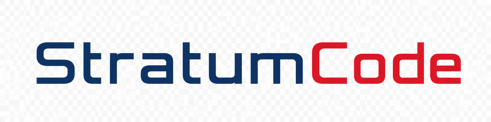

<p align="center">
  
</p>

<p align="center">
  
</p>

<p align="center">
  <strong>证据驱动，契约先行。</strong>
</p>

<p align="center">
  一个本地优先的软件工程 Agent。不会直接从你的指令跳到改代码——<br/>
  而是走完任务分析、代码调查、设计决策、可执行施工计划、事务式修改和独立验证一整套流程。<br/>
  每一步都可追踪、可审计、可回退。
</p>

<p align="center">
  
  
  
  
  
  
</p>

---

## 为什么要做这个

从去年开始，我几乎把所有编码工作都交给了 AI。起初还算克制——自己设计好架构、定好接口，再让 Claude 逐个文件产出。后来 Copilot 的 agent 能力上线，我连设计都省了。需求丢进去，等结果，不好就再试一次。现在流行叫"许愿式编程"。

效率当然高。毕设那会儿产出速度是原来的三四倍。以前一天最多写一千行，现在可能只是一个对话的量。

但有些东西在消失。以前写完一段代码，脑子里就能预演运行效果，最后看着自己一砖一瓦搭起来的东西在屏幕上跑——那种爽感是不言而喻的。还有对代码质量的执念：硬编码不能忍、高耦合不能忍、为了可维护性整日整夜地琢磨。

Agent 改变了这一切。输出量太大了，大到我已经不再 Review，只看最终效果。代码变成了黑箱，而我成了验收机器。

大约半年前，纯 agent coding 到了瓶颈期。我试着转回手写，但尝过那种效率之后，很难回头。就像工业革命时期，你还在抱着珍妮机，别人已经流水线了。

所以我开始读 ReAct、Toolformer 这些早期 agent 论文，试遍了市面上的主流 coding agent，最终决定自己做。

**StratumCode**，直译是"代码层析"，但我更喜欢叫它"代码考古"。

Agent 出现之前的程序员，每天做的最多的事是在电脑前发呆。根据函数名跳转看实现、根据字段名查引用、在脑子里把整个模块跑起来，构建一个庞大的代码网络。其实很像考古——从一个小碎片开始，逐渐扩展，最终拼出一个庞大造物的真相。

这个 agent 也是这个思路。我要用程序化的契约和 runtime 管理来硬性约束流程，而不是靠 skill 写一堆提示词苦口婆心求模型遵守。

## 核心理念

> **模型负责提议。Runtime 负责验证、授权、记录和路由。**

大多数 coding agent 追求从需求到补丁的最短路径。这很高效——直到需求本身的假设是错的、代码库告诉你另一个故事、或者一个看似合理的修改悄悄破坏了某处的契约。

StratumCode 换了一个前提：**软件变更在被执行之前，应该是可以被解释的。**

## 工作流

StratumCode 用一个明确的状态机串联整个过程。每个阶段有独立的职责和转移规则：

```
用户需求 → Task Analysis → Investigation → Design → Patch Planning → Implementation → Validation
                  ↑               ↑                         ↑                      │
                  └── 证据不足 ───┘                         └── 需修复 ─────────────┘
                                                                  需重设计 ──────────┘
                                                                  需用户确认 ────────→ 提问
```

### 1. Task Analysis — 搞清楚你到底要什么

不只是解析自然语言。这个阶段产出：

- **任务分类**：Feature / Bugfix / Refactor / Investigation 等
- **Goal**：从你的输入中提取核心意图
- **Unknowns**：哪些事现在还不清楚、需要调查
- **Acceptance Criteria**：任务结束时，哪些可观察事实必须成立
- **Behavior Contract**：这个功能在接口层面怎么运作？输入是什么、输出是什么、什么叫成功、什么叫失败、边界在哪里
- **Scope**：这次做什么、明确不做什么、还有什么悬而未决

### 2. Investigation — 像个真程序员一样调查代码

围绕 Unknowns 展开，逐一解决。模型可以调用：

- 基础工具：Read、Grep、Glob
- LSP 工具：符号释义、定义跳转、引用查找、实现跳转——就跟你用 IDE 时一样
- MCP：如果你配置了并且刚好相关
- Web：搜索和抓取

还有一个专门做**假设验证**的子代理。碰到需要大规模验证的假设时调用，强制走"找支持证据 → 找反对证据 → 审计证据关系 → 分析结论"的流程。结果不是"我觉得"，而是"97% 置信，假设成立"。

调查的终点不是"模型觉得够了"，而是每条 Unknown 都被解决，每条 Acceptance 都有项目事实支撑。

### 3. Design — 先想清楚再动手

设计阶段不碰代码，只产出设计文档。它把 Acceptance Criteria 转化为：

- **Requirements**：保留与原始 Acceptance 的对应关系，不在重新表述中改变验收语义
- **Project Alignment**：每条需求对照项目现状——已满足 (Matched)、明确缺失 (Missing)、还是证据不足 (Ambiguous)
- **Design Decision**：综合所有需求和现状，决定最终采用什么设计。每条决策必须说明**解决了哪些需求**、**基于什么事实**

这里讨论的是行为、职责边界、状态流和数据流。不是"修改哪个文件"。

### 4. Patch Planning — 把设计拆成可执行的施工计划

对每条 Design Decision，先判断是否真的需要改代码（可能现有实现已经满足）。如果需要，生成具体的 Implementation Step：

- 哪个文件、哪个函数/组件
- 做什么操作
- 完成条件是什么
- 如果删掉这一步会失去什么
- 这一步不应该顺便碰什么

然后进入第二轮审计：每条 Acceptance 被哪些 Step 覆盖？验证用的命令和操作有项目事实支撑吗？Step 之间需要合并吗？有 Step 的 Purpose、Action 和 Completion Conditions 偏离了原始设计吗？

### 5. Implementation — 事务式修改

这是第一个真正改代码的阶段。但不是在 IDE 里随便改——每次修改都必须指定 Step ID，通过 `apply_patch` 执行。Runtime 自动注入授权 ID、Plan Hash、关联的 Acceptance 和 Design Decision。模型不能改计划外的文件，也不能擅自扩大某一步的职责。

修改前必须先读取文件快照。修改后 Runtime 校验：文件存在？目标代码文本已加入或移除？零 diff 的 Patch 直接拒绝。

如果 Implementation 中途失败，已经应用的 Patch 会按照 Rollback Record 倒序回滚，不留下半成品的施工痕迹。

### 6. Validation — 独立验收

Validation 不信任 Implementation 说的"已经完成"。它重新读取修改后的代码，对照原始 Acceptance、Patch Plan 和 Change Records，独立判断：

- 每条 Step 是否完整执行
- 实际修改是否符合 Design，有没有遗漏、偏离或扩张
- 最终行为是否满足 Acceptance Criteria

至少需要一次成功的工具检查才能给 `passed`。只根据计划总结、没有实际读代码或跑检查就宣布成功——是不允许的。

可能的结果：

| 结果 | 含义 |
|------|------|
| `passed` | 验证通过，任务完成 |
| `local_repair` | 设计对但实现有问题，返回 Design 重新规划 |
| `redesign` | 设计方案本身不足或错误 |
| `missing_evidence` | 证据不足以判断，返回 Investigation |
| `clearify` | 存在产品选择需要你确认 |
| `inconclusive` | 无法形成可靠结论 |

## Skills 系统

Skills 可以按阶段部署，而不是一股脑全塞进 prompt。你可以给全局定义、给某个具体阶段定义、两者可以被独立配置或叠加。

内置 `find-skills` 命令可以在线搜索安装。每个阶段开始时强制模型选择 0 到多个 skill，中途如果需要也可以主动加载。渐进式披露，避免 prompt 污染。

## 安全保障

StratumCode 的正确性不依赖于模型遵循一段提示词文本。以下是 runtime 层面的硬约束：

- **显式执行模式**：只读任务不会悄悄变成实施任务
- **范围授权**：Patch 只能触碰授权 Step 所指定的文件
- **不可变 Plan Hash**：Patch 请求必须匹配已授权的计划
- **文件快照**：修改已有文件前必须先读取
- **陈旧检测**：并发修改使过期快照失效
- **原子提交**：多文件 Patch 作为一个事务提交
- **零 diff 拒绝**：没有真实变更不能声称进度
- **Patch 记录**：每个 Step 的意图、文件、哈希和 diff 都被记录
- **回滚**：失败的 Implementation 可以恢复已提交的文件
- **证据门槛**：`passed` 必须有一次成功的验证工具结果

## 快速开始

### 环境要求

- Python **3.13+**
- Node.js 和 npm
- [`uv`](https://docs.astral.sh/uv/)
- 一个通过应用内配置的模型提供商

### 安装运行

```bash
git clone https://github.com/iiishop/StratumCode.git
cd StratumCode

uv sync
npm --prefix frontend install

# 生产模式
uv run stratumcode

# 开发模式（API + Vite 热更新 + pywebview）
uv run stratumcode-dev
```

首次生产启动时，如果 `frontend/dist` 不存在，会自动构建 Vue 前端。

## 桌面界面

`pywebview` 原生窗口承载 Vue 3 前端。不是命令行工具——你有：

- **工作区和会话管理**：不同仓库互不干扰，可恢复
- **Providers 配置**：OpenAI 兼容端点 + 实验性 Codex OAuth
- **MCP 集成**：外部工具和仓库智能
- **LSP 支持**：符号、定义、引用、悬浮信息、诊断
- **Skills 面板**：按全局、阶段、子代理配置能力
- **时间线事件**：证据、工具、代理、任务、过渡、计划、补丁、验证结果一览
- **用量统计**：Token、缓存和费用信息

## 项目结构

```
StratumCode/
├── frontend/              Vue 3 + Vite 桌面 UI
│   └── src/
│       ├── components/    页面、时间线事件、计划和检查器
│       └── composables/   前端状态和 API 集成
│
├── stratumcode/
│   ├── chat.py            显式运行状态机
│   ├── status/            各阶段状态处理器和任务契约
│   ├── investigator.py    证据收集和 Unknown 消解
│   ├── design_planner.py  基于事实的设计编制
│   ├── patch_planner.py   可执行 Patch Plan 生成
│   ├── implementation_runner.py  实施和验证循环
│   ├── patch_engine.py    快照、原子编辑和回滚
│   ├── patch_authorization.py   Plan 和 Step 级别写授权
│   ├── skill_runtime.py   阶段/子代理 skill 加载
│   ├── tools/             内置工具注册
│   ├── lsp/               Language Server Protocol 集成
│   ├── mcp/               Model Context Protocol 客户端
│   ├── providers.py       模型提供商和 Codex 传输
│   ├── sessions.py        持久会话工件
│   └── server.py          本地应用 API
│
└── pyproject.toml         Python 包和 CLI 入口
```

## 当前状态

> [!IMPORTANT]
> StratumCode 处于 **Alpha** 阶段。契约格式、存储结构、Provider 传输和 UI 都可能随提交变化。请在版本控制的仓库上使用，依赖修改前 Review diff。

### 已实现

- [x] 带工作区和会话管理的本地桌面应用
- [x] 完整的 Task Analysis → Investigation → Design → Patch → Validation 状态机
- [x] 结构化任务契约、Unknown、观察、信念、验收标准
- [x] OpenAI 兼容 Provider + 实验性 Codex OAuth
- [x] MCP 服务发现和动态工具注册
- [x] LSP 符号、定义、引用、悬浮、诊断
- [x] 按全局/阶段/子代理配置的动态 Skills
- [x] Patch 授权、快照、陈旧检测、原子写入、回滚
- [x] 结构化时间线事件和用量统计

### 开发中

- [ ] 更丰富的仓库智能和可复用上下文
- [ ] 按任务类型的针对性调查策略
- [ ] 更完整的可执行 Patch Plan 确定性校验
- [ ] 更广泛的工具支持（测试、构建、格式化、静态检查）
- [ ] 完整的修复路由（范围、环境、产品决策类失败）
- [ ] 带依赖感知的持久化工程记忆
- [ ] 固定 Benchmark 套件（Bugfix、Feature、Refactor、UI、Config、Concurrency）

## 近期方向

- 为每个项目实现持久化的工程记忆
- 架构设计专用子代理
- 跨前后端调用流程链可视化——从触发到结束的全过程
- Git 集成、CI/CD 集成

## 贡献

特别欢迎以下方向的贡献：

- Runtime 契约和确定性校验器
- 仓库索引和代码导航
- 安全补丁和并发编辑保护
- LSP 和 MCP 互操作
- 评估任务和回归测试
- Provider 适配器和本地模型支持
- Vue 界面的开发者体验改进

大的架构变动前请先开 Issue，确认职责边界后再动手。

---

<p align="center">
  <strong>StratumCode</strong><br/>
  审查证据。理解决策。信任 diff。
</p>
